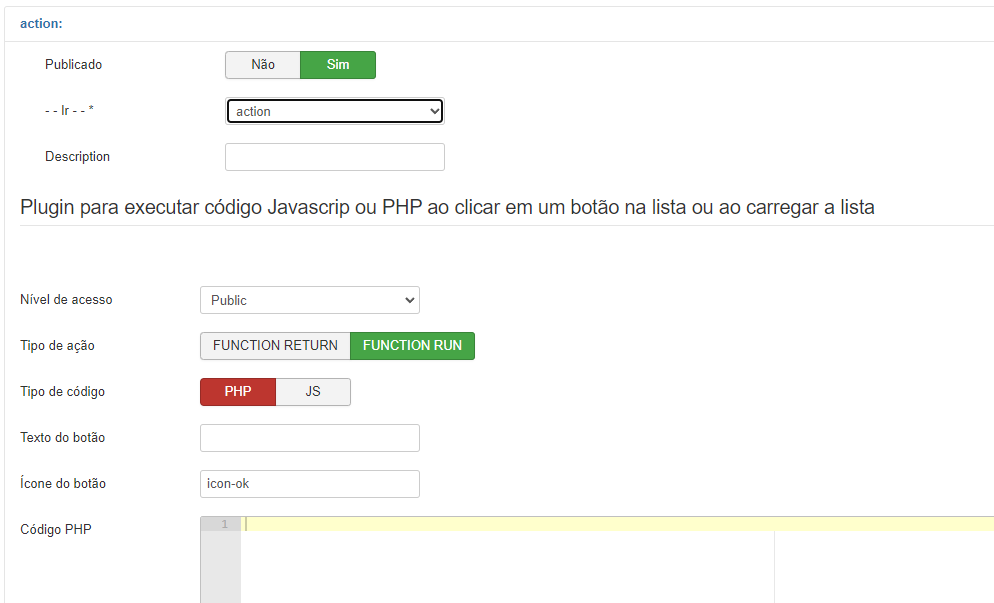
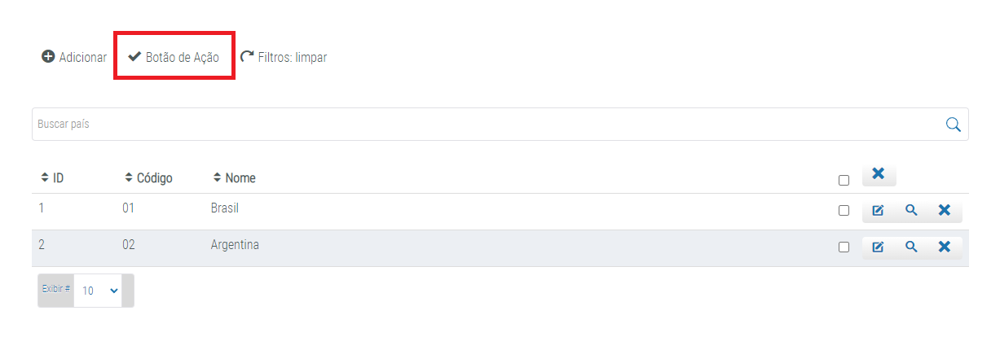

# Fabrik List Action

  

## Sobre

O plugin Action List permite adicionar uma nova ação na linha de ações de uma lista. O plugin pode funcionar em um conjunto com um módulo ou com um código próprio em PHP ou Javascript, o script cadastrado será executado assim que o usuário clicar no botão. A ação é exibida conforme a configuração do nível de acesso.

## Especificações

  

 

- Nível de Acesso: Determina o nível de acesso do usuário que ve a ação.
- Tipo de Ação: Mostra um botão que executa um código php ou imprime o resultado do código php (return da função) ignorando o botão.
- Tipo de código: Se será executado um código PHP ou código Javascript
- Texto do botão: Rótulo do botão
- Ícone do botão: O ícone exibido no botão (pode ficar em branco).
- Código PHP: O código a ser executado caso selecionado Tipo PHP
- Código Javascript: O código a ser executado caso selecionado Tipo Javascript
- Mensagem de sucesso: Mensagem a ser exibida após a execução caso julgue necessário.

## Uso

Após a configuração do botão com os parâmetros desejados e com o script devidamente configurado, o botão aparecerá no topo da lista e executará o script PHP ou Javascript ao ser clicado e a mensagem exibida logo após caso configurada.

 

  

