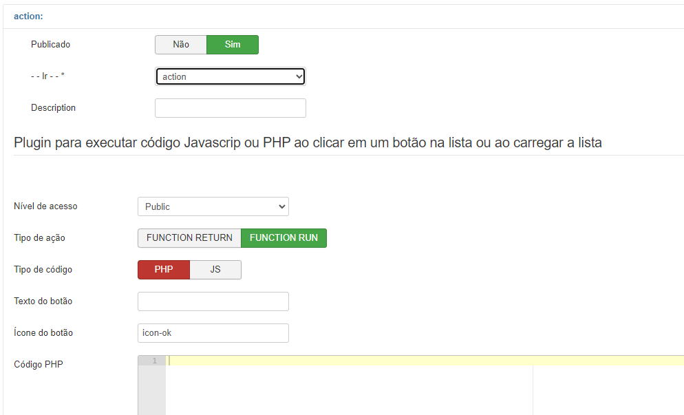
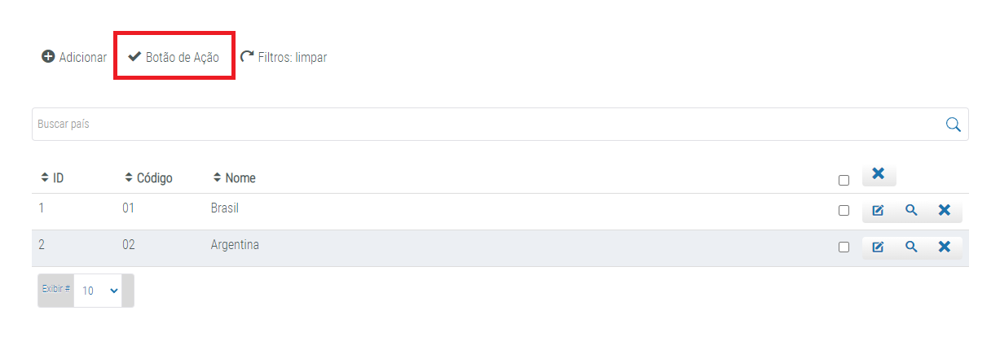

# Fabrik Action List 

  

## Sobre
O plugin `Action List` permite adicionar uma nova ação na linha de ações de uma lista. Este plugin pode funcionar em conjunto com um módulo ou com códigos próprios em PHP ou Javascript, o script cadastrado será executado assim que o usuário clicar no botão. A ação é exibida conforme a configuração do nível de acesso.

## Especificações

  

 

- `Nível de Acesso`: Determina o nível de acesso do usuário que vê a ação.
- `Tipo de Ação`: O `FUNCTION RETURN` imprime o resultado do código PHP, enquanto que o `FUNCTION RUN` exibe um botão que executa um código PHP.
- `Tipo de código`: Indicar a linguagem do código a ser executado - PHP ou Javascript.
- `Texto do botão`: Rótulo do botão.
- `Ícone do botão`: O ícone exibido no botão (pode ficar em branco).
- `Código PHP`: O código a ser executado caso selecionado Tipo PHP.
- `Código Javascript`: O código a ser executado caso selecionado Tipo Javascript.
- `Mensagem de sucesso`: Mensagem a ser exibida após a execução caso julgue necessário.

## Uso

Após realizar as configurações necessárias inserindo os parâmetros desejados e o script, o `Botão de Ação` aparecerá no topo da lista e, ao ser clicado executará o script indicado (PHP ou Javascript), em seguida será exibido a `Mensagem de sucesso`, caso tenha sido configurada.

 

  

